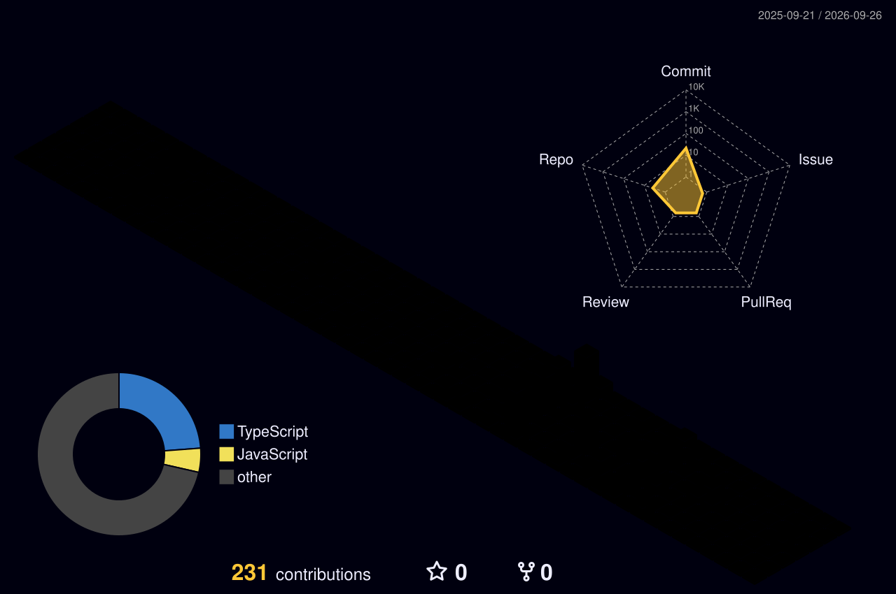

  

# Amna Khalid | Software Developer

<h1 align="center">
    
</h1>

<h3 align="center">Building functional, high-performance web and mobile solutions with clean code and modern design.</h3>

🔭 I am **Full Stack Software Developer** focused on building complete, user-centric applications for **Web** and **Mobile**.  
🌱 Currently building high-quality digital experiences with **React**, **React Native**, **Flutter**, **Next.js**, and **WordPress**.  
💬 Ask me about creating **cross-platform mobile apps**, **WordPress solutions**, or **performant web interfaces**.  
⚡ Dedicated to solving complex frontend challenges and maintaining high standards of code excellence.

 
  
  

<h2 align="center">🚀 Technical Stack 🚀</h2>

  <h3>Programming Languages</h3>
  
  
  
  
  

 

  <h3>Frameworks, Libraries & CMS</h3>
  
  
  
  
  
  

 

  <h3>UI/UX & Design Tools</h3>
  
  

 

  <h3>Developer Ecosystem</h3>
  
  
  
  

<h2 align="center">📈 GitHub Analytics</h2>

  

  
  

  

<h2 align="center">🌟 Featured Projects</h2>

### [PROACTIVECARE-RPM](https://github.com/Amna-Khalid-786/PROACTIVECARE-RPM)
*A sophisticated Remote Patient Monitoring system focusing on frontend excellence and real-time health tracking.*

### [devfolio-site](https://github.com/Amna-Khalid-786/devfolio-site)
*A professional personal portfolio site built with React and TypeScript, showcasing performant frontend architecture.*

### [Airline Reservation System](https://github.com/Amna-Khalid-786/Airline-Reservation-System)
*A robust C++ console-based application for managing flight bookings and functional logic.*

  <h2>🌌 3D Contribution Universe 🌌</h2>
   
  <!-- 3D Isometric View -->
  

 

  <i>"Building beautiful, functional, and user-centric frontend experiences."</i>

